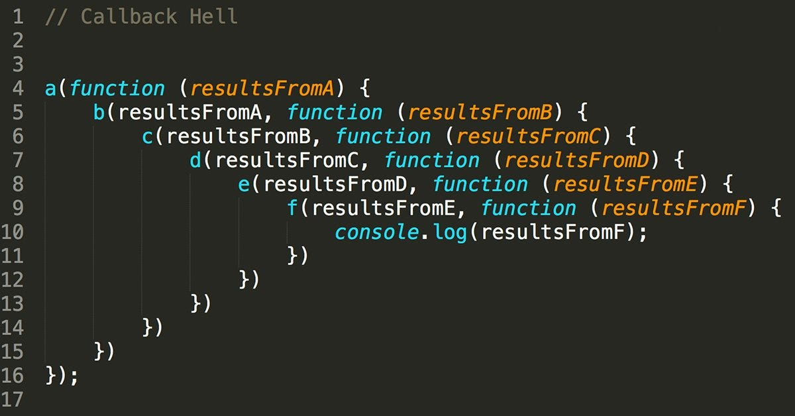

# 03. Callbacks, Promises, and Async/Await

JavaScript is asynchronous, meaning it doesn't always wait for one task to finish before starting the next. This is crucial for tasks like fetching data from a database.

```javascript title="basic.js"
function first() {
	console.log(`First function`);
}

function second() {
	console.log(`Second function`);
}

function third() {
	console.log(`Third function`);
}

first();
second();
third(); 
```
```text { .text .no-copy linenums="0" }
node basic.js

First function
Second function
Third function
```

```javascript title="basic.js" hl_lines="6-8"
function first() {
	console.log(`First function`);
}

function second() {
	fetch(`https://jsonplaceholder.typicode.com/users/1`)
		.then((res) => res.json())
		.then((user) => console.log(`Second function - ${user.name}`));
}

function third() {
	console.log(`Third function`);
}

first();
second();
third(); 
```
```text { .text .no-copy linenums="0" }
node basic.js

First function
Third function
Second function - Leanne Graham
```
## 🎯 Learning Objectives

- Understanding the evolution of handling asynchronous code.
- Implementing Callbacks, Promises, and Async/Await.

## 📞 1. Callbacks

A callback is a function passed as an argument to another function.

```javascript title="callback.js" hl_lines="1 3 6 10"
function first(callback) {
    console.log(`First function`);
    callback();
}

function second(callback) {
	fetch(`https://jsonplaceholder.typicode.com/users/1`)
		.then((res) => res.json())
		.then((user) => console.log(`Second function - ${user.name}`))
        .then(() => callback());
}

function third() {
    console.log(`Third function`);
}

first(() => {
    second(() => {
        third();
    });
});  

//first(() => second(() => third()));   
```

**Problem**: If you have many nested callbacks, it leads to "Callback Hell", which is hard to read.



## 🤝 2. Promises

A Promise represents a value that will be available later. It can be **resolved** (success) or **rejected** (error).

```javascript title="promise.js"

function first() {
    return new Promise((resolve) => resolve(`First function`));
}

function second() {
    return new Promise((resolve) => {
        fetch(`https://jsonplaceholder.typicode.com/users/1`)
            .then((res) => res.json())
            .then((user) => resolve(`Second function - ${user.name}`));
    });
}

function third() {
    return new Promise((resolve) => resolve(`Third function`));
}

/*
first()
    .then((firstMessage) => {
        console.log(firstMessage);
        return second();
    }).then((secondMessage) => {
        console.log(secondMessage);
        return third();
    }).then((thirdMessage) => {
        console.log(thirdMessage);
    });
*/

first()
    .then(firstMessage => console.log(firstMessage))
    .then(() => second()
                .then(secondMessage => console.log(secondMessage)))
                .then(() => third()
                            .then(thirdMessage => console.log(thirdMessage)))       


```

## ⏳ 3. Async and Await

The most modern and readable way. It looks like synchronous code but works asynchronously.

### Example: Async/Await Style

```javascript title="async-await.js"
function first() {
    console.log(`First function`);
}

async function second() {
	await fetch(`https://jsonplaceholder.typicode.com/users/1`)
		.then((res) => res.json())
		.then((user) => console.log(`Second function - ${user.name}`));
}

function third() {
    console.log(`Third function`);
}

// (async () => {
//     first();
//     await second();
//     third();    
// })();

// this is valid from version node 24 onward
first();
await second();
third();    
```

## 📋 Key Terms

- **Resolve**: Success signal in a Promise.
- **Reject**: Error signal in a Promise.
- **then/catch**: Methods to handle Promise success or failure.
- **async**: Declares that a function contains asynchronous code.
- **await**: Pauses the function execution until the Promise resolves.

## 🛠️ Step-by-Step

1. Write a function that "prepares pizza" after 3 seconds.
2. Use a Promise to handle the delay.
3. Call it using `async/await`.

## ⚠️ Common Errors

- **Forgetting `await`**: If you forget `await`, you get the Promise object instead of the data.
- **`await` outside `async`**: You can only use `await` inside a function marked with the `async` keyword.

---

**Summary**: Async/Await is our best friend for writing clean, readable code that handles delays!
