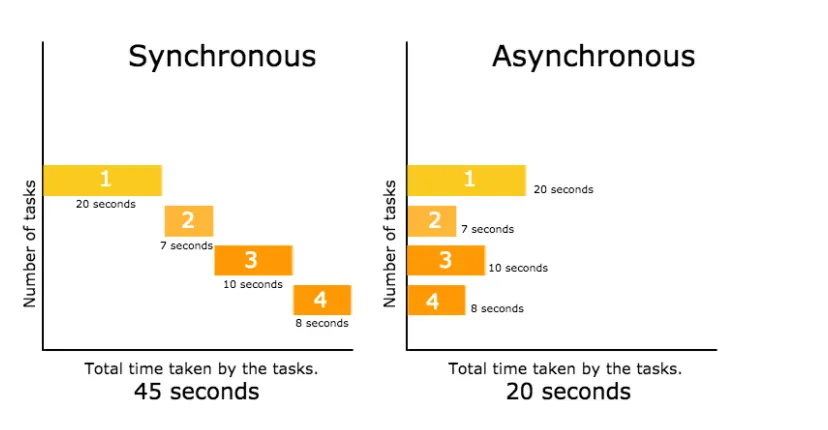

# 02. Synchronous vs Asynchronous Code

Node.js is famous for being "non-blocking". Understanding this is the key to building fast applications.

## 🎯 Learning Objectives
- Understanding blocking vs non-blocking code.
- Comparing Synchronous and Asynchronous file reading.



## ⏱️ Blocking (Synchronous)
In synchronous code, every task must finish before the next one starts.

```txt title="test.txt"
1
2
3
4
5
```

```javascript title="index.js"
import fs from 'fs';

console.log("Start reading file...");
const data = fs.readFileSync('test.txt', 'utf8'); // Blocks here
console.log(data);
console.log("Finish!");
```

```text { .text .no-copy linenums="0" }
node index.js 
Start reading file...
1
2
3
4
5
Finish!
```

## 🚀 Non-Blocking (Asynchronous)
In asynchronous code, Node.js starts a task and moves to the next one immediately. It handles the result later in a callback.

```javascript hl_lines="4-7"
import fs from 'fs';

console.log("Start reading file...");
fs.readFile('test.txt', 'utf8', (err, data) => {
  if (err) throw err;
  console.log(data); // This happens later
});
console.log("I didn't wait for the file!");
```
```text { .text .no-copy linenums="0" }
node index.js 
Start reading file...
I didn't wait for the file!
1
2
3
4
5
```
## 💡 Real-world Analogy
- **Synchronous**: A waiter takes one order, goes to the kitchen, waits for the food to be cooked, then brings it to the table before helping the next customer. (Slow!)
- **Asynchronous**: A waiter takes an order, gives it to the kitchen, and immediately helps the next customer. When the food is ready, they bring it out. (Efficient!)

## 🛠️ Practice Exercise
Create a file `delay.js`. Use `setTimeout(() => { console.log("I am late"); }, 3000);` and place a `console.log("I am first");` after it. Run it and observe the order.

## 📋 Summary Table
| Feature | Synchronous | Asynchronous |
|---------|-------------|--------------|
| **Execution** | Line by line | Does not wait |
| **Speed** | Can be slow (Blocking) | Very fast (Non-blocking) |
| **Use case** | Simple scripts | Web servers, APIs |

---
**Summary**: Node.js defaults to asynchronous execution to keep applications responsive and fast!
