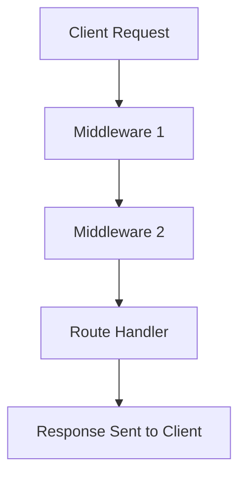
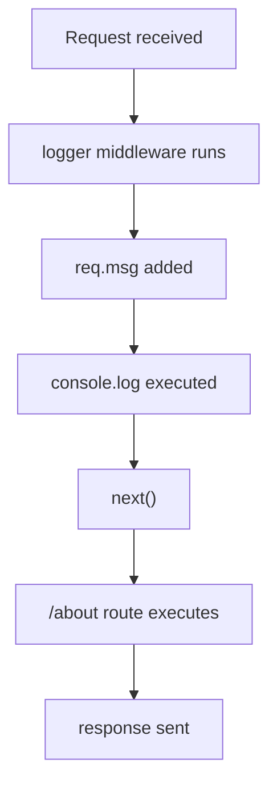
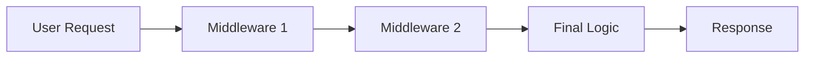

# 07. Middleware in Node.js

Middleware functions are functions that have access to the request and response objects and are executed during the lifecycle of a request.

## 🎯 Learning Objectives
- Understanding the purpose of middleware.
- Learning the "Pipeline" concept.
- Implementing a simple logging middleware.

In Node.js and Express.js, a **middleware** is a function that runs **between the request and the response**.

Middleware can:

* Read request data
* Modify request or response objects
* Execute code
* Stop requests
* Call the next middleware
* Send responses

## Middleware Flow



In your code, you created two middleware functions:

```js
const logger = (req, res, next) => {
  req.msg = "<br>This is from logger middleware!";
  console.log(`${req.method} ${req.url}`);
  next();
};
```

and

```js
const auth = (req, res, next) => {
  if (req.query.username === "peter") {
    next();
  } else {
    res.send("Unauthorized Access");
  }
};
```

## 1. Logger Middleware

### Code

```js
const logger = (req, res, next) => {
  req.msg = "<br>This is from logger middleware!";
  console.log(`${req.method} ${req.url}`);
  next();
};
```

### Explanation

#### Parameters

| Parameter | Meaning                             |
| --------- | ----------------------------------- |
| `req`     | Request object                      |
| `res`     | Response object                     |
| `next`    | Function to move to next middleware |

---

### What This Middleware Does

#### Step 1: Add Custom Data to Request

```js
req.msg = "<br>This is from logger middleware!";
```

You are adding a new property called `msg` into the request object.

Now every route after this middleware can use:

```js
req.msg
```

---

#### Step 2: Log Request Information

```js
console.log(`${req.method} ${req.url}`);
```

Example output:

```text
GET /
GET /about
GET /login?username=peter
```

---

#### Step 3: Call next()

```js
next();
```

This is VERY IMPORTANT.

`next()` tells Express:

> "Continue to the next middleware or route."

Without `next()`, the request will hang forever.

---

#### Using Middleware Globally

```js
app.use(logger);
```

This means:

> Run logger middleware for EVERY request.

So these routes all use logger:

```js
/
 /about
 /login
 /api
```

---

## Example Flow

User visits:

```text
http://localhost:3000/about
```

Flow:




Final response:

```html
About Us!
This is from logger middleware!
```

---

## 2. Authentication Middleware

### Code

```js
const auth = (req, res, next) => {
  if (req.query.username === "peter") {
    next();
  } else {
    res.send("Unauthorized Access");
  }
};
```

## Purpose

This middleware checks if the user is authorized.

---

## Query Parameter

If URL is:

```text
/login?username=peter
```

Then:

```js
req.query.username
```

contains:

```js
"peter"
```

---

## Authentication Logic

### Allowed User

```js
if (req.query.username === "peter")
```

If username is `"peter"`:

```js
next();
```

User is allowed.

---

### Unauthorized User

Otherwise:

```js
res.send("Unauthorized Access");
```

The request stops here.

No next middleware or route will run.

---

## Route-Level Middleware

```js
app.get("/login", auth, (req, res) => {
  res.send(`Welcome to the dashboard!  ${req.msg}`);
});
```

This means:


The middleware only works for `/login`.

---

## Successful Request Example

URL:

```text
http://localhost:3000/login?username=peter
```

Flow:


Response:

```html
Welcome to the dashboard!
This is from logger middleware!
```

---

## Failed Request Example

URL:

```text
http://localhost:3000/login
```

or

```text
http://localhost:3000/login?username=ali
```

Response:

```text
Unauthorized Access
```

Route handler will NOT execute.

---

## Types of Middleware in Express

| Type                   | Description            |
| ---------------------- | ---------------------- |
| Application Middleware | `app.use()`            |
| Route Middleware       | Used on specific route |
| Built-in Middleware    | `express.json()`       |
| Third-party Middleware | `cors`, `morgan`       |
| Error Middleware       | Handles errors         |

---

## Built-in Middleware Example

### JSON Middleware

```js
app.use(express.json());
```

This converts JSON request body into JavaScript object.

Example:

```json
{
  "name": "Ali"
}
```

Accessible as:

```js
req.body.name
```

---

## Real-Life Middleware Examples

| Middleware     | Purpose                   |
| -------------- | ------------------------- |
| Logger         | Log requests              |
| Authentication | Verify user               |
| Authorization  | Check permissions         |
| Validation     | Validate data             |
| CORS           | Allow frontend access     |
| JSON Parser    | Parse JSON body           |
| Error Handler  | Handle application errors |

---

## Middleware Execution Order

Order matters in Express.

Example:

```js
app.use(logger);
app.use(auth);
```

Execution:

```text
logger → auth → route
```

If reversed:

```js
app.use(auth);
app.use(logger);
```

Execution becomes:

```text
auth → logger → route
```

---

## Important Rule

Always:

* call `next()`
  OR
* send a response

Otherwise request hangs.

Wrong:

```js
const middleware = (req, res, next) => {
  console.log("Hello");
};
```

Correct:

```js
const middleware = (req, res, next) => {
  console.log("Hello");
  next();
};
```

---

## Your Middleware Summary

| Middleware | Purpose                              |
| ---------- | ------------------------------------ |
| `logger`   | Logs request and adds custom message |
| `auth`     | Checks username authorization        |

---

## Simple Analogy

Middleware is like a security checkpoint:

```text
Request enters server
↓
Security checks (middleware)
↓
Allowed to enter route
↓
Response returned
```


## 🛣️ The Middleware Pipeline
Think of middleware as a security check or a logger that sits between the **User** and the **Final Logic**.





## 📦 Why use Middleware?
1. **Logging**: Record every request that hits the server.
2. **Authentication**: Check if the user is logged in before letting them see private data.
3. **Parsing**: Convert incoming data (like JSON) into something JS can understand.
4. **Error Handling**: Catch errors and send a friendly message.

## 🛠️ Simple Example (Logic)
```javascript
function logger(req, res, next) {
  console.log(`${new Date().toISOString()} - ${req.method} ${req.url}`);
  next(); // Go to the next middleware or logic!
}
```
If you forget to call `next()`, the request will hang forever!

## ❓ Practice Exercise
Imagine you want to block users who are not from your country. How would middleware help?
- **Answer**: It would check the request headers and if they aren't from the allowed country, it would send an error response *before* even reaching your main application logic.

---
**Summary**: Middleware is like a filter. It processes requests before they reach their final destination!
