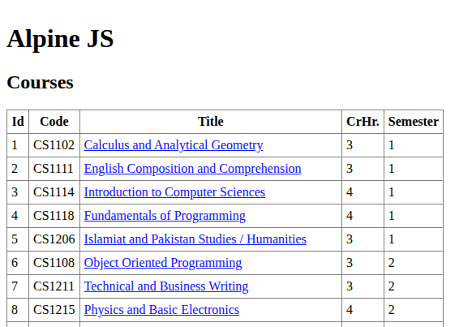
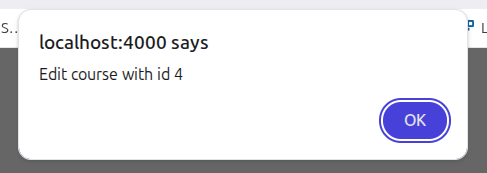
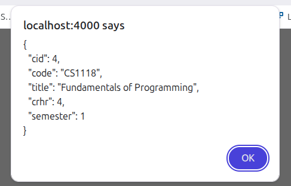
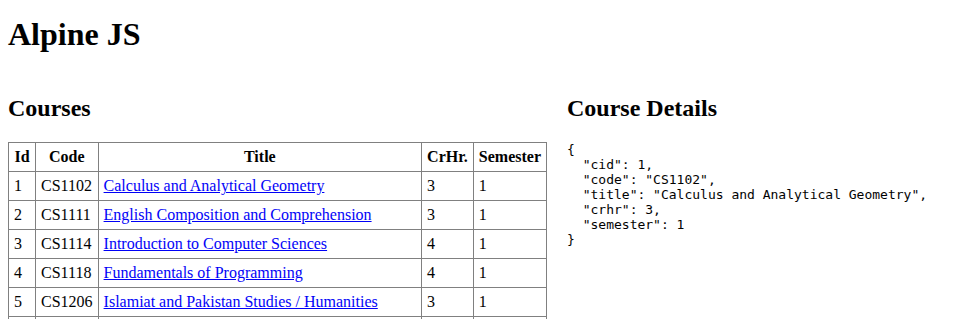
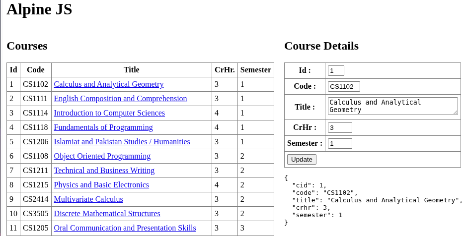

# 14. Alpine.js CRUD Application

Now we will build a frontend that uses our API! We will use **Alpine.js**, a lightweight frontend framework that works perfectly for small projects.

## 🎯 Learning Objectives

* **Connecting Frontend to Backend using `fetch()`**: Learn how to use the modern browser `fetch` API to send asynchronous HTTP requests to backend REST API endpoints. You will practice utilizing `fetch` for various HTTP verbs (like `GET` and `POST`), parsing JSON response streams with `.json()`, and using `async`/`await` patterns for clean, robust asynchronous control flow.
* **Using Alpine.js for data binding and reactivity**: Understand the paradigm of reactive UI development. You will learn how Alpine.js keeps your application state and DOM synchronized in real-time, eliminating the need for tedious manual DOM queries (such as `document.getElementById`) or explicit DOM manipulations when data changes.
* **Building a full CRUD (Create, Read, Update, Delete) UI**: Master the integration of CRUD features. You will learn to construct dynamic interactive components, display tabular database records, load specific items into editing forms, save user updates securely back to a persistent database, and reflect those changes instantly on the screen.

## 🔍 Key Alpine.js Directives

* **`x-data`**: Declares a new reactive component scope and defines its initial state (variables and functions). Any HTML element within this element's tree can seamlessly read and write to this reactive state.
  * *Example*: `<div x-data="{ count: 0 }">` initializes a component with a `count` property set to `0`.
* **`x-model`**: Establishes dynamic, two-way data binding on form input elements (such as `<input>`, `<textarea>`, or `<select>`). Any changes the user types into the input immediately update the underlying JavaScript state, and any programmatic changes to the state are immediately reflected in the input value.
  * *Example*: `<input type="text" x-model="selectedCourse.title">` binds the input's value to `selectedCourse.title`.
* **`x-for`**: Renders elements dynamically by iterating through a collection or array, similar to a JavaScript loop. It requires a `<template>` wrapper and a unique key binding (e.g., `:key`) to optimize DOM rendering and track changes.
  * *Example*: `<template x-for="course in courses" :key="course.cid">` renders a row for each course in the list.
* **`@click`**: A powerful, shorthand directive for `x-on:click` that registers event listeners to capture pointer click events on an element. It triggers either inline JavaScript expressions or references to methods defined inside the component scope.
  * *Example*: `<button type="button" @click="Save()">Update</button>` calls the component's `Save` method on click.
* **`init()` / `x-init`**: A lifecycle hook or directive that runs custom initialization expressions or functions automatically after Alpine.js has successfully initialized the component and mounted it to the DOM. This is the ideal lifecycle stage for pre-fetching data from remote APIs.
  * *Example*: `<body x-data="App()" x-init="getCourses()">` calls the `getCourses` method as soon as the body element initializes.

---

1. Create `public` and `views` folders in your project root.
   - Use `public` for static files such as CSS, client-side JavaScript, and images.
   - Use `views` for HTML pages rendered by Express (for this lesson, `index.html`).
   - In `index.js`, keep `express.static(__dirname + "/public")` and send the homepage from `views/index.html`.

```javascript hl_lines="3-5 9-10 13" title="index.js"
import express from "express";
import courseRoutes from "./routes/courseRoutes.js";
import { dirname } from "path";
import { fileURLToPath } from "url";
import path from "path";
const app = express();
const PORT = 4000;

const __dirname = dirname(fileURLToPath(import.meta.url));
app.use(express.static(__dirname + "/public"));
app.use("/api", courseRoutes);

app.get("/", (req, res) =>
  res.sendFile(path.join(__dirname, "views", "index.html")),
);

app.listen(PORT, () =>
  console.log(`Express server running at http://localhost:${PORT}`),
);
```

2. Create `index.html` in the `views` folder.
   - Start with a basic HTML5 structure (`<!DOCTYPE html>`, `<html>`, `<head>`, `<body>`).
   - Add a page title and heading so you can confirm the route is working.
   - Make sure visiting `http://localhost:4000` returns this file from your Express route.

```html title="index.html"
<!DOCTYPE html>
<html lang="en">
  <head>
    <meta charset="UTF-8" />
    <meta name="viewport" content="width=device-width, initial-scale=1.0" />
    <title>Alpine JS</title>
  </head>
  <body>
    <h1>Alpine JS</h1>
  </body>
</html>
```

3. Load the Alpine.js library in the `<head>` section and test it with a small interactive example.
   - Add `<script src="//unpkg.com/alpinejs" defer></script>` inside `<head>`.
   - Use `x-data`, `@click`, and `x-show` in `<body>` to verify Alpine reactivity.
   - If the toggle works in the browser, Alpine is connected correctly and you are ready for CRUD UI logic.

```html title="index.html" hl_lines="6 11-15"
<!doctype html>
<html lang="en">
  <head>
    <meta charset="UTF-8" />
    <meta name="viewport" content="width=device-width, initial-scale=1.0" />
    <script src="//unpkg.com/alpinejs" defer></script>
    <title>Alpine JS</title>
  </head>
  <body>
    <h1>Alpine JS</h1>
    <div x-data="{ open: false }">
      <button @click="open = !open">Expand</button>

      <span x-show="open"> Content... </span>
    </div>
  </body>
</html>
```

5. Test your Home Page in the browser [http://localhost:4000](http://localhost:4000).

## Call REST API

1. We can call `()=>{}` (arrow function) to call an REST API and `console.log()` to log the outout in Dev Tools

```html title="index.html" hl_lines="1-3 6-8" linenums="9"
<body
  x-data="{ courses: [] }"
  x-init="courses = await fetch('/api/courses').then(res => res.json()); 
        console.log(courses)"
></body>
<h1>Alpine JS</h1>
<div>
  <pre x-text="JSON.stringify(courses, null, 2)"></pre>
</div>
```

## List Courses

1. Create `app.js` file `public` forlder
2. Use `/api/courses` API in `app.js`. Create `async` function `getCourses()` and call REST API through `fetch`

```javascript title="app.js" hl_lines="3-8"
function App() {
  return {
    courses: [],
    async getCourses() {
      const response = await fetch("/api/courses").then((res) => res.json());
      this.courses = response;
      console.log(this.courses);
    },
  };
}
```

3. Create an array name `courses` which will store the result of an API call.

```html title="index.html" hl_lines="2 5" linenums="6"
    <script src="//unpkg.com/alpinejs" defer></script>
    <script src="app.js"></script>
    <title>Alpine JS</title>
  </head>
  <body x-data="App()" x-init="getCourses()">
    <h1>Alpine JS</h1>
```

4. `x-for` dirctive is used to iterate collections and display in HTML. We will use `x-for` to show courses in a table

```html title="index.html" hl_lines="2-22"
<h1>Alpine JS</h1>
<div>
  <h2>Courses</h2>
  <table>
    <tr>
      <th>Id</th>
      <th>Code</th>
      <th>Title</th>
      <th>CrHr.</th>
      <th>Semester</th>
    </tr>
    <template x-for="course in courses" :key="course.cid">
      <tr>
        <td x-text="course.cid"></td>
        <td x-text="course.code"></td>
        <td x-text="course.title"></td>
        <td x-text="course.crhr"></td>
        <td x-text="course.semester"></td>
      </tr>
    </template>
  </table>
</div>
```

```html title="index.html" hl_lines="2-17" linenums="7"
<script src="app.js"></script>
<style>
  table {
    border-collapse: collapse;
  }
  th,
  td {
    border: 1px solid #808080;
    padding: 5px;
  }
</style>
```


## Edit

1. To edit a record we need to create a link on title, which is used to get cid for the specific record

```html linenums="38" hl_lines="2-6" title="index.html"
<td x-text="course.code"></td>
<td>
  <a href="#" x-text="course.title" @click.prevent="Edit(`${course.cid}`)"></a>
</td>
<td x-text="course.crhr"></td>
```

```javascript hl_lines="6-8" title="app.js"
        async getCourses(){
            const response = await fetch("/api/courses").then(res => res.json());
            this.courses = response;
            console.log(this.courses);
        },
        async Edit(cid){
            alert(`Edit course with id ${cid}`);
        }
```

2. Add css in `<style>` tag

```style title="index.html"
	  a:visited {
		color: blue;
	  }
```

 
3. When we click on any course Title, it will show alert
 
4. If courses are already fetched we can use `find()` method to return single course. if we need to ftech data from other table than we need to call REST API call to retrieve course by Id.

```javascript title="app.js" hl_lines="4 11-15"
function App() {
  return {
    courses: [],
    selectedCourse: {},
    async getCourses() {
      const response = await fetch("/api/courses").then((res) => res.json());
      this.courses = response;
      console.log(this.courses);
    },
    async Edit(cid) {
      // this.selectedCourse = this.courses.find(course => course.cid === cid);

      const response = await fetch(`/api/courses/${cid}`).then((res) =>
        res.json(),
      );
      this.selectedCourse = response;
      alert(JSON.stringify(this.selectedCourse, null, 2));
    },
  };
}
```

```javascript linenums="12" title="courseRoutes.js"
router.get("/courses/:cid", async (req, res) => {
  const { cid } = req.params;
  const course = await SQL`SELECT * FROM course WHERE cid = ${cid};`;
  res.status(200).json(course[0]);
});
```



```html title="index.html"
<div style="display: flex;">
    <div>
    <!-- List -->
    </div>
    <div x-show="Object.keys(selectedCourse).length !== 0">
        <h2>Course Details</h2>
        <pre x-text="JSON.stringify(selectedCourse, null, 2)"></pre>
    </div>
</div>
```

5. Create a `<form>` tags, to display selectedCourse in a form. In an `@click` event `Save()` method is used to call POST API to save changes in database. we are using `x-model` to bind the data in form fields.
```javascript title="index.html" hl_lines="3-29"
        <div x-show="Object.keys(selectedCourse).length !== 0">
            <h2>Course Details</h2>
            <form>
                <table>
                    <tr>
                        <th>Id : </th>
                        <td><input type="text" x-model="selectedCourse.cid" name="cid" readonly size="1"></td>
                    </tr>
                    <tr>
                        <th>Code : </th>
                        <td><input type="text" x-model="selectedCourse.code" name="code" size="5"></td>
                    </tr>
                    <tr>
                        <th>Title : </th>
                        <td><textarea x-model="selectedCourse.title" name="title" rows="2" cols="30"></textarea></td>
                    </tr>
                    <tr>
                        <th>CrHr : </th>
                        <td><input type="text" x-model="selectedCourse.crhr" name="crhr" size="3"></td>
                    </tr>
                    <tr>
                        <th>Semester : </th>
                        <td><input type="text" x-model="selectedCourse.semester" name="semester" size="3"></td>
                    </tr>
                    <tr>
                        <td colspan="2"><button type="button" @click="Save()">Update</button></td>
                    </tr>
                </table>
            </form>
            <pre x-text="JSON.stringify(selectedCourse, null, 2)"></pre>
        </div>
```
6. Create Save function in `app.js` to update the course. It will call POST API to save changes in database.
```javascript title="app.js" 
        async Save() {
            const response = await fetch("/api/courses", {
                method: "POST",
                headers: {
                    "Content-Type": "application/json",
                },
                body: JSON.stringify(this.selectedCourse),
            }).then(res => res.json());
            this.selectedCourse = {};
            await this.getCourses();
        }
```
7. Write a POST API to update the course. It will check if cid is present in the body and update the course using SQL UPDATE statement. 

```javascript title="courseRoutes.js" hl_lines="9-13"
router.post("/courses", async (req, res) => {
    const { cid, code, title, crhr, semester } = req.body;
    if (cid) {
        const course = await SQL`UPDATE course SET code = ${code}, title = ${title}, crhr = ${crhr}, semester = ${semester} WHERE cid = ${cid} RETURNING *;`;
        res.status(200).json(course[0]);
    }
});
```
8. Now we can edit and save the course. 



# ❓ Practice Task
## 🛠️ The Backend Setup

Ensure your Express server handles all CRUD methods:

```javascript
// routes/studentRoutes.js
router.put('/:id', (req, res) => { ... });
router.delete('/:id', (req, res) => { ... });
```

## 🏗️ The Frontend (index.html)

We link to Alpine.js via CDN:

```html
<!DOCTYPE html>
<html>
  <head>
    <script
      defer
      src="https://unpkg.com/alpinejs@3.x.x/dist/cdn.min.js"
    ></script>
    <script src="https://cdn.tailwindcss.com"></script>
  </head>
  <body class="bg-gray-100 p-8">
    <div
      x-data="studentApp()"
      class="max-w-md mx-auto bg-white p-6 rounded shadow"
    >
      <h1 class="text-2xl font-bold mb-4">Student Manager</h1>

      <!-- Add Form -->
      <div class="mb-4">
        <input
          x-model="newName"
          type="text"
          placeholder="Name"
          class="border p-2 w-full mb-2"
        />
        <button @click="addStudent()" class="bg-blue-500 text-white p-2 w-full">
          Add Student
        </button>
      </div>

      <!-- List -->
      <ul>
        <template x-for="student in students" :key="student.id">
          <li class="flex justify-between items-center border-b py-2">
            <span x-text="student.name"></span>
            <button @click="deleteStudent(student.id)" class="text-red-500">
              Delete
            </button>
          </li>
        </template>
      </ul>
    </div>

    <script>
      function studentApp() {
        return {
          students: [],
          newName: "",
          async init() {
            const res = await fetch("/students");
            this.students = await res.json();
          },
          async addStudent() {
            const res = await fetch("/students", {
              method: "POST",
              headers: { "Content-Type": "application/json" },
              body: JSON.stringify({ name: this.newName }),
            });
            const newStudent = await res.json();
            this.students.push(newStudent);
            this.newName = "";
          },
          async deleteStudent(id) {
            await fetch(`/students/${id}`, { method: "DELETE" });
            this.students = this.students.filter((s) => s.id !== id);
          },
        };
      }
    </script>
  </body>
</html>
```

## 🛠️ Step-by-Step

1. Create a `public/index.html` file with the code above.
2. In `server.js`, add `app.use(express.static('public'))` to serve this file.
3. Start your server and visit `http://localhost:3000`.

---

**Summary**: Alpine.js plus Express REST API is a powerful combination for building fast, modern web apps!
